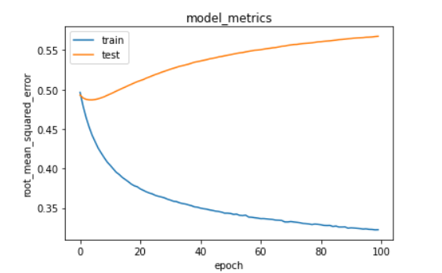

# Laporan Proyek Machine Learning - Renol Nindi Kara N

## Project Overview

Perkembangan teknologi yang sangat pesat di bidang digital, membuat manusia semakin mudah dalam melakukan segala hal yang berada di internet. Salah satu hal yang menjadi bidang utama perkembangan digital yaitu bidang multimedia termasuk musik, video, dll.

Seiring pesatnya perkembangan digital di bidang multimedia, aplikasi pemutar musik pun ikut turut berkembang. Aplikasi musik saat ini sudah dilengkapi lirik otomatis, berbagi playlist, rekomendasi musik dari musik musik yang pernah kita dan orang lain dengar dan masih banyak lagi.

Sistem rekomendasi merupakan sebuah sistem pendukung keputusan yang membantu pengguna aplikasi musik dapat menerima rekomendasi musik musik yang sesuai dengan kriterianya. Sistem rekomendasi musik ini mengambil informasi informasi seperti lagu yang pernah didengar, genre kesukaan, lagu yang diputar berulang ulang, dan masih banyak yang lainnya. Maka dari itu penulis akan membuat sebuah sistem rekomendasi yang dapat membantu manusia mendapat rekomendasi musik kesukaanya tanpa harus lelah mencari dan berpikir apa musik yang harus saya dengarkan selanjutnya. [1]

## Business Understanding

### Problem Statements

- Bagaimana cara merekomendasikan music yang disukai pengguna lain dapat diminati dan dijadikan rekomendasi untuk pengguna lainnya?

### Goals

- Membuat Sistem Rekomendasi berdasarkan <em> target (recurring listening event) </em> dan aktivitas pengguna masa lalu

Semua poin di atas harus diuraikan dengan jelas. Anda bebas menuliskan berapa pernyataan masalah dan juga goals yang diinginkan.

### Solution Approach

Solusi yang saya ajukan yaitu dengan menggunakan 2 algoritma machine learning untuk sistem rekomendasi yaitu:

- <em>Content Based Filtering</em> adalah algoritma yang merekomendasikan item serupa dengan apa yang disukai pengguna, berdasarkan tindakan mereka sebelumnya atau umpan balik eksplisit. Algoritma ini memberikan rekomendasi berdasarkan aktivitas pada masa lalu.

- <em>Collaborative Filtering </em> adalah algoritma yang bergantung pada pendapat komunitas pengguna. Dia tidak memerlukan atribut untuk setiap itemnya. Algoritma ini memberikan rekomendasi berdasarkan nilai rating atau nilai lain, disini saya menggunakan target sebagai dasar penilaian.

Algoritma <em>Content Based Filtering</em> digunakan untuk memberikan rekomendasi berdasarkan aktivitas masa lalu, lalu untuk Algoritma <em>Collaborative Filtering </em> digunakan untuk memberikan rekomendasi berdasarkan <em> target (recurring listening event) </em>

## Data Understanding

Data atau datasets yang digunakan pada proyek <em> Machine Learning </em> ini adalah data <em> WSDM - KKBox's Music Recommendation Challenge </em> yang bisa diakses di [link berikut ini (kaggle)](https://www.kaggle.com/competitions/kkbox-music-recommendation-challenge/data).

Variabel-variabel yang terdapat pada dataset adalah sebagai berikut:

#### train.csv : (7377418 data, 6 columns)

    msno: user id

    song_id: song id

    source_system_tab: ini adalah nama tab / page dimana peristiwa pemutaran musik dipicu misalnya library, search, dll

    source_screen_name: tata letak yang dilihat pengguna misal Explore, Radio, Album More, dll.

    source_type: Titik masuk pengguna pertama kali memutar musik di aplikasi misalnya song, song-based-playlist, my-daily-playlist, dll.

    target: target ini seperti pemicu jika user mendengarkan musik berulang yang dipicu satu bulan setelah mendengarkan musik untuk yang pertama kalinya

#### test.csv : (data, columns)

    id: row id (will be used for submission)

    msno: user id

    song_id: song id

    source_system_tab: ini adalah nama tab / page dimana peristiwa pemutaran musik dipicu misalnya library, search, dll

    source_screen_name: tata letak yang dilihat pengguna misal Explore, Radio, Album More, dll.

    source_type: Titik masuk pengguna pertama kali memutar musik di aplikasi misalnya song, song-based-playlist, my-daily-playlist, dll.

#### sample_submission.csv (We not use this file)

#### songs.csv

The songs. Note that data is in unicode.

    song_id

    song_length: in ms

    genre_ids: genre kategory, ini digambarkan dalam id, value aslinya seperti pop, rock, dll.

    artist_name: nama artist / penyanyi

    composer: nama composer

    lyricist

    language

#### members.csv

user information.

    msno: user id

    city

    bd: age. Note: this column has outlier values, please use your judgement.

    gender

    registered_via: metode daftar

    registration_init_time: format %Y%m%d

    expiration_date: format %Y%m%d

#### song_extra_info.csv

    song_id

    song name - nama lagu

    isrc - International Standard Recording Core. identitas sebuah lagu.

### EDA

Pada Gambar 1 ada beberapa unbalance value, tetapi tidak bermasalah karena memang kebanyakan user rata-rata membuka dari my library ketika memutar musik / pemutaran musik dipicu.

Gambar 1. Kontribusi Variabel untuk Kolom <em>source_system_tab </em>

Pada Gambar 2 menyimpulkan kebanyakan pelanggan memutar musik saat keadaan layar di <em>local playlist</em>. Ini berarti pelanggan selalu menyimpan <em>playlist</em> kesukaan mereka di local

Gambar 2. Kontribusi Variabel untuk Kolom <em>source_screen_name </em>

Pada Gambar 3 ini membuktikan bahwa ketiga kolom (<em> source_system_tab, source_screen_name, source_type </em>) ini saling berkaitan, maka dari itu meskipun banyak value yang unbalanced ini dapat dibantu dengan kolom lainnya.

Gambar 3. Kontribusi Variabel untuk Kolom <em>source_type </em>

Pada Gambar 4 ini menjelaskan bahwa ada beberapa user yang memutar lagunya kembali setelah satu bulan sejak lagu tersebut diputar pertama kali, maupun sebaliknya.

Gambar 4. Kontribusi Variabel untuk Kolom <em>target </em>

Pada Gambar 5 menyimpulkan bahwa pada datasets ini kebanyakan pendengar musik adalah laki-laki / men.

Gambar 5. Kontribusi Variabel untuk Kolom <em>gender </em>

<em>Exploratory Data Analysis</em> melihat kontribusi variabel terhadap data dengan <em>countplot</em>.

## Data Preparation

### Merge Datasets for Gather Information

Untuk tahap awal saya menggabungkan beberapa data untuk tahap awal analisis. Berikut datanya, ini merupakan gabugan dari train.csv, songs.csv dan members.csv

Tabel 1. <em> Merger Data </em>

| index | msno                                         | song_id                                      | source_system_tab | source_screen_name  | source_type     | target | song_length | genre_ids | artist_name     | composer                                          | lyricist | language | city | bd  | gender | registered_via | registration_init_time | expiration_date |
| ----- | -------------------------------------------- | -------------------------------------------- | ----------------- | ------------------- | --------------- | ------ | ----------- | --------- | --------------- | ------------------------------------------------- | -------- | -------- | ---- | --- | ------ | -------------- | ---------------------- | --------------- |
| 0     | FGtllVqz18RPiwJj/edr2gV78zirAiY/9SmYvia+kCg= | BBzumQNXUHKdEBOB7mAJuzok+IJA1c2Ryg/yzTF6tik= | explore           | Explore             | online-playlist | 1      | 206471.0    | 359       | Bastille        | Dan Smith&#124; Mark Crew                         | NaN      | 52.0     | 1    | 0   | NaN    | 7              | 20120102               | 20171005        |
| 1     | Xumu+NIjS6QYVxDS4/t3SawvJ7viT9hPKXmf0RtLNx8= | bhp/MpSNoqoxOIB+/l8WPqu6jldth4DIpCm3ayXnJqM= | my library        | Local playlist more | local-playlist  | 1      | 284584.0    | 1259      | Various Artists | NaN                                               | NaN      | 52.0     | 13   | 24  | female | 9              | 20110525               | 20170911        |
| 2     | Xumu+NIjS6QYVxDS4/t3SawvJ7viT9hPKXmf0RtLNx8= | JNWfrrC7zNN7BdMpsISKa4Mw+xVJYNnxXh3/Epw7QgY= | my library        | Local playlist more | local-playlist  | 1      | 225396.0    | 1259      | Nas             | N. Jones、W. Adams、J. Lordan、D. Ingle           | NaN      | 52.0     | 13   | 24  | female | 9              | 20110525               | 20170911        |
| 3     | Xumu+NIjS6QYVxDS4/t3SawvJ7viT9hPKXmf0RtLNx8= | 2A87tzfnJTSWqD7gIZHisolhe4DMdzkbd6LzO1KHjNs= | my library        | Local playlist more | local-playlist  | 1      | 255512.0    | 1019      | Soundway        | Kwadwo Donkoh                                     | NaN      | -1.0     | 13   | 24  | female | 9              | 20110525               | 20170911        |
| 4     | FGtllVqz18RPiwJj/edr2gV78zirAiY/9SmYvia+kCg= | 3qm6XTZ6MOCU11x8FIVbAGH5l5uMkT3/ZalWG1oo2Gc= | explore           | Explore             | online-playlist | 1      | 187802.0    | 1011      | Brett Young     | Brett Young&#124; Kelly Archer&#124; Justin Ebach | NaN      | 52.0     | 1    | 0   | NaN    | 7              | 20120102               | 20171005        |

Bisa dipahami banyak sekali fitur yang bisa digunakan, tetapi nantinya akan kita <em> drop </em> di langkah berikutnya, kita tidak akan menggunakan semua fitur nya.

### Handling Null Values

Handling null values yang saya gunakan yaitu dengan drop.

Tabel 2. <em> Summary of Null Values Every Each Column </em>

| Column                 | Data Type | Unique Values | Null Values | % null Values |
| ---------------------- | --------- | ------------- | ----------- | ------------- |
| lyricist               | object    | 33888         | 3178798     | 0.430882      |
| gender                 | object    | 2             | 2961479     | 0.401425      |
| composer               | object    | 76064         | 1675706     | 0.227140      |
| source_screen_name     | object    | 20            | 414804      | 0.056226      |
| genre_ids              | object    | 572           | 118455      | 0.016056      |
| source_system_tab      | object    | 8             | 24849       | 0.003368      |
| source_type            | object    | 12            | 21539       | 0.002920      |
| language               | float64   | 10            | 150         | 0.000020      |
| song_length            | float64   | 60266         | 114         | 0.000015      |
| artist_name            | object    | 40582         | 114         | 0.000015      |
| bd                     | int64     | 92            | 0           | 0.000000      |
| registration_init_time | int64     | 3811          | 0           | 0.000000      |
| registered_via         | int64     | 5             | 0           | 0.000000      |
| msno                   | object    | 30755         | 0           | 0.000000      |
| city                   | int64     | 21            | 0           | 0.000000      |
| song_id                | object    | 359966        | 0           | 0.000000      |
| target                 | int64     | 2             | 0           | 0.000000      |
| expiration_date        | int64     | 1395          | 0           | 0.000000      |

Dapat dilihat dari data diatas sangat banyak sekali null values, maka dari itu saya akan drop data data yang null ? kenapa drop?, data ada sekitar 7 juta data null paling tinggi ada 43 persen, jadi kita masih mempunyai banyak data setelah di drop maupun belum.

Setelah di drop total data ada sekitar 2.3 Juta data.

### Filter Column

Kita akan memilih column mana saja yang menuru hasil analisis EDA dan menurut pandangan kita sebagai seorang engineer yang dapat mempengaruhi kinerja model

berikut kolom yang saya pilih

<em>
['song_id', 'source_system_tab', 'source_screen_name', 'source_type', 'target', 'artist_name', 'genre_ids',  'gender']
</em>

### Bad Value

Saya menyadari banyak sekali value kategorikal yang berbanding jauh dengan yang lainnya misalnya genre, ada genre yang hanya memiliki 1 value sedangkan genre lainnya diatas 100. Maka dari itu saya akan drop value yang jumlah nya kurang dari 100

### Correlation

Gambar 6. <em>Correlation Matrix</em>

Correlation ini merupakan sebuah teknik atau metode untuk melihat keterkaitan, korelasi, hubungan antara <em>feature</em> dengan <em>feature</em> lainnya.

Disini kita akan menganalisis keterkaiatan <em>feature</em> terhadap kolom target, ada beberapa <em>feature</em> yang sangat kecil korelasi nya terhadap target, tetapi jika feature tersebut di drop akan sangat berpengaruh terhadap feature lainnya, misalnya <em>source_screen_name, source_system_tab, source type</em>. Ketiga <em>feature</em> tersebut sangat berpengaruh ke model, karena kita bisa memberikan rekomendasi saat user berada pada kondisi layar dimana, apa yang biasa pertama kali user buka, dll.

### Label Encoder

<em>Label Encoder</em> merupakan step di <em>Machine Learning </em> yang sangat krusial / wajib dilakukan, label encoder ini berfungsi untuk mengubah data kategorikal menjadi bentuk angka, seperti yang kita pelajari dulu bahwa inputan <em>Machine Learning </em> itu harus angka / numeric, maka dari itu kita perlu mengkonversi nya terlebih dahulu

#### Encoding

Sebenarnya ini step digunakan pada saat membuat <em>Collaborative Filtering</em>, tapi step nya hampir sama dengan <em>label encoder</em>, hanya saja di <em>encoding</em> ini ada beberapa step yang memang berguna nanti untuk testing / memprediksi data baru.

### Train Test Split

Saya disini menggunakan rasio 8:2, yaitu 80% untuk train dan 20% untuk validation.

Kita Perlu membagi datasets ke dalam train dan validasi, data train sendiri berfungsi untuk melatih model, data validasi berfungsi untuk memvalidasi model diluar data train, data validasi ini berfungsi untuk memberitahu model bahwa model yang sedang dibuat masih belum cukup baik dalam memprediksi data baru. Data validasi ini biasa digunakan dalam <em> callback </em> untuk mempercepat waktu <em> training </em> karena kita akan memonitor <em> val_loss </em>

## Modeling

- Metode Content Based Filtering

  Content based filtering menggunakan informasi tentang beberapa item/data untuk merekomendasikan kepada pengguna sebagai referensi mengenai informasi yang digunakan sebelumnya. Tujuan dari content based filtering adalah untuk memprediksi persamaan sejumlah informasi yang didapat dari pengguna. Sebagai contoh, seorang pendengar musik sedang mendengar musik bergenre reggae. Platform musik online secara sistem akan merekomendasikan si pengguna untuk mendengarkan musik lain yang berhubungan dengan reggae.
  Dalam pembuatannya, content based filtering menggunakan konsep perhitungan Cosine Similarity yang intinya mengukur kesamaan antara dua vektor dan menentukan apakah kedua vektor tersebut menunjuk ke arah yang sama.

  Cosine similarity mengukur kesamaan antara dua vektor dan menentukan apakah kedua vektor tersebut menunjuk ke arah yang sama. Ia menghitung sudut cosinus antara dua vektor. Semakin kecil sudut cosinus, semakin besar nilai cosine similarity.

  Berikut rumus dari Cosine Similarity

  cosine similarity = $\sum_{i=1}^n * A_i B_i \over \sum_{i=1}^n * A_i^2 * \sum_{i=1}^n * B_i^2$

        Dik :

        A : Product Item 1
        B : Product Item 2

  - Data yang digunakan pada metode ini adalah data yang disukai oleh pengguna pada masa lalu. Rekomendasi yang dihasilkan merupakan rekomendasi yang berdasarkan data pengguna tersebut di masa lalu.
  - Hasil top N Recommendation terhadap genre 165
    <code>recommend_songs_to_you(df, '465', 'male')</code>

        dan hasil Top N Recommendation nya

        Tabel 3. <em>Top N Recommendation</em>

        | index | song_id                                      | Similar with genre ids 465 | artist_name     | gender |
        | ----- | -------------------------------------------- | -------------------------- | --------------- | ------ |
        | 1     | +bzRWCwvoHacMsPkQ3Jmrh1MbglNiypd0AJ0p2bnnzk= | 465                        | Various Artists | female |
        | 2     | +lbvPHJMcegCSlBVvJToZsbIjQsxaNq47xU5vyYapmw= | 921                        | 五月天 (Mayday) | female |
        | 3     | +m8MlkHwqUeccI9+TZ/0oCQnLjm3nZQuVm9TqGFZcWE= | 465                        | 五月天 (Mayday) | male   |
        | 4     | +fy1NsOrg5k5KwXdolS2P3aktNuU8Loo3AjdUJNbYyM= | 921                        | Various Artists | male   |
        | 5     | +j10/5AhYRqlypDXRy/0/cVolyLClN4ap8v6flLnJAE= | 465                        | 五月天 (Mayday) | male   |
        | 6     | +YNPKIOIi46G1WL0/mIlrJqToBDLlgMJWnb3RtSepwQ= | 465                        | Various Artists | male   |

- Metode Colaborative Filtering

  Metode Colaborative filtering merupakan metode yang melakukan proses penyaringan item yang berdasarkan pengguna lain, dengan cara memberikan informasi kepada pengguna berdasarkan kemiripan karakteristik. Dalam pembuatanya saya menggunakan RecommenderNet, pada tahap ini model menghitung skor kecocokan antara pengguna dan musik dengan teknik embedding. Pertama, kita melakukan proses embedding terhadap data user dan musik. Selanjutnya, lakukan operasi perkalian dot product antara embedding user dan musik. Selain itu, kita juga dapat menambahkan bias untuk setiap user dan musik. Skor kecocokan ditetapkan dalam skala [0,1] dengan fungsi aktivasi sigmoid. Metode ini menggunakan Binary Crossentropy untuk menghitung loss function, Adam (Adaptive Moment Estimation) sebagai optimizer, dan root mean squared error (RMSE) sebagai metrics evaluation. [5]

  - Data yang digunakan pada metode ini adalah data yang berupa nilai, biasanya rating. Disini saya meenggunakan kolom target / kolom yang merupakan pemicu bahwa user memutar lagunya kembali setelah 1 bulan sejak diputar pertama kali.
  - Top N Recommendation yang dihasilkan sebagai berikut.

    Showing recommendations for users: ofjzUYkREGy1Se49aITIvrdW4SRzqyFGl2tvgSkDNIc=

    song with high target from user

    - 人生的歌
    - 月牙灣 (Crescent Bay)
    - 月牙灣 (Crescent Bay)
    - 愛到才知痛
    - 人生的歌

    Top 10 song recommendation

    - 遠在眼前的你
    - Everyday
    - 曹操
    - I Like That
    - 曹操
    - Everyday
    - 戰神
    - I Like That
    - 曹操
    - 戰神

### Kelebihan Content Based Filtering dan Colaborative Filtering

#### Kelebihan

Kelebihan dari metode <em>content-based filtering</em> adalah dapat memiliki kemampuan merekomendasikan hal baru kepada user, karena prinsip kerjanya yaitu dengan melihat deskripsi konten yang dikandung oleh item yang pernah diberi rating tinggi sebelumnya oleh pengguna. [3]

Kelebihan dari metode <em> Colaborative Filtering </em> adalah dapat menghasilkan rekomendasi yang berkualitas baik. [4]

#### Kelemahan

Kelemahan dari metode <em>content-based filtering</em> adalah terbatasnya rekomendasi hanya pada item-item yang mirip sehingga tidak ada kesempatan untuk mendapatkan item yang tidak terduga. [2]

Kekurangan dari metode <em> Colaborative Filtering </em> adalah kompleksitas perhitungan akan semakin bertambah seiring dengan bertambahnya pengguna sistem, semakin banyak pengguna yang menggunakan sistem maka sistem perekomendasian akan semakin lama. [4]

## Evaluation

Untuk Content Base Filtering saya saya akan menghitung precision nya dengan rumus berikut.

recommender system precision = p $ \text {of recommendations that are relevants} \over \text{of items we recommended} $

Untuk cara menghitung nya disini saya meminta rekomendasi music untuk genre 165

Bisa dilihat di tabel 3 ada 4 dari 6 rekomendasi diberikan yang sesuai artinya kita hitung precision nya dengan cara

p = $4 \over 6$

p = 0.66 % atau 66%

Selanjutnya adalah untuk Model Colaborative Filtering karena model yang digunakan adalah model regressi, maka saya akan menggunakan metric untuk evaluasi, berikut adalah metric nya:

### Root Mean Squared Error (RMSE)

<em>Root Mean Squared Error (RMSE)</em> merupakan salah satu cara untuk mengevaluasi model regresi dengan mengukur tingkat akurasi hasil perkiraan suatu model. RMSE dihitung dengan mengkuadratkan error (prediksi – observasi) dibagi dengan jumlah data (= rata-rata), lalu diakarkan.

Nilai RMSE rendah menunjukkan bahwa variasi nilai yang dihasilkan oleh suatu model prakiraan mendekati variasi nilai obeservasinya. RMSE menghitung seberapa berbedanya seperangkat nilai. Semakin kecil nilai RMSE, semakin dekat nilai yang diprediksi dan diamati.

Kelebihan dari RMSE yaitu memiliki tingkat sensitivitas yang cukup tinggi. Sedangkan kekurangannya RMSE tidak menggambarkan kesalahan rata-rata saja namun memiliki implikasi lain yang lebih sulit untuk diurai dan dipahami.

rmse = $\sqrt{\sum\nolimits_{n=1}^n \left((y_i - ŷ_i) ^ 2 \over n \right) }$

Diketahui:

- n = Jumlah Data
- yi = Actual Value / Nilai Sebenarnya
- ŷi = Predicted Value / Nilai Prediksi

Hasil Graph Evaluasi

Gambar 7. <em>Loss Train and Test Model Metrics </em>

Dapat disimpulkan model ini sedikit overfit, seperti yang kita lihat jika dengan data <em> train rmse </em> semakin mengecil, tetapi jika dengan data validasi sebaliknya. Ini disebabkan karena sedikit nya improvisasi <em> datasets </em>, dikarenakan keterbatasan komputasi saya hanya bisa memasukan max 100.000 <em>row</em> dalam <em> datasets </em> saja, jika lebih maka akan <em>out of memory</em>.

## Kesimpulan

Setelah melalui beberapa tahap diputuskan bahwa kedua model yang penulis gunakan dapat memprediksi dengan baik sesuai dengan apa yang diharapkan meskipun dengan data yang dikikis sebagian. Keterbatasan komputasi merupakan tantangan utama penulis dalam mengerjakan sistem rekomendasi ini, penulis terpaksa memangkas beberapa data supaya dapat dikerjakan oleh sistem.

## Daftar Referensi

Referensi

[1] Kunialam. D. "Implementasi Metode K-Means Clustering untuk Sistem Rekomendasi Playlist Musik". Skripsi Prodi Teknik Informatika Fakultas Teknologi Informasi Universitas Kristen Duta Wacana. 2016. https://katalog.ukdw.ac.id/1581/1/22084584_bab1_bab5_daftarpustaka.pdf [accessed Nov. 6 2022]

[2] Mondi. R. H, et al., <em>Recommendation System with Content-Based Fitlering Method for Culinary Tourism in Mangan Application</em>. Jurnal Ilmiah Teknologi dan Informasi. Vol 8, no. 2. 65-72, 2019. https://jurnal.uns.ac.id/itsmart/article/download/35008/27748#:~:text=Kelemahan%20dari%20metode%20content%2Dbased,mendapatkan%20item%20yang%20tidak%20terduga. [accessed Nov. 6 2022]

[3] Devi. A. A. P, and Tonara. D. B. "Rancang Bangun Recommender System dengan Metode Collaborative Filtering untuk Studi Kasus Tempat Kuliner di Surabaya". JUISI. Vol 1, no. 2, 102-112, 2015. https://dspace.uc.ac.id/bitstream/handle/123456789/1104/RS1512093.pdf?sequence=1&isAllowed=y#:~:text=Kelebihan%20recommender%20system%20dengan%20pendekatan,pernah%20diberi%20nilai%20rating%20tinggi [accessed Nov. 6 2022]

[4] Handrico. A. "Sistem rekomendasi buku perpustakaan fakultas sains dan teknologi dengan metode <em>collaborative filtering</em>". Jurusan Teknik Informatika, Fakultas sains dan Teknologi universitas Islam negeri Sultan Syarif Kasim Riau. Pekanbaru. [accessed Nov. 6 2022]

[5] Dicoding. "Kelas Machine Learning Terapan." https://www.dicoding.com/academies/319 [accessed Nov. 4 2022]
